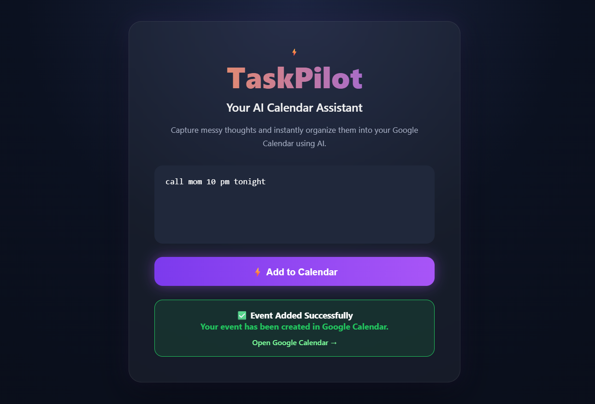
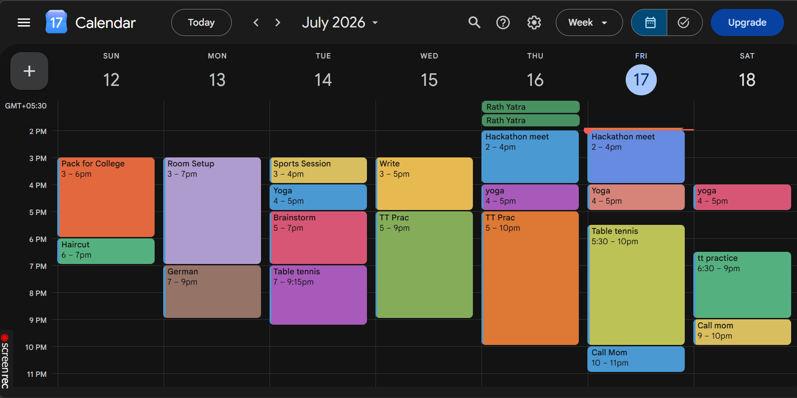

# ⚡ TaskPilot AI

An AI-powered calendar assistant that converts natural language into Google Calendar events using **Google Gemini AI**.

---

## 🚀 Example

**Input**

> "Physics viva tomorrow at 10 AM"

⬇️

🧠 Gemini understands the event details.

⬇️

📅 A Google Calendar event is created automatically.

---

## 📸 Screenshots

### TaskPilot Interface



### Google Calendar Event



## ✨ Features

- 🧠 Natural language event extraction
- 📅 Google Calendar integration
- 🔐 Secure Google OAuth authentication
- ⚡ One-click event creation
- 🎨 Clean and responsive Flask web interface
- 🤖 Powered by Google Gemini AI

---

## 🛠 Tech Stack

- Python
- Flask
- HTML
- CSS
- JavaScript
- Google Gemini API
- Google Calendar API

---

## 📂 Project Structure

```
TaskPilot-AI/
│── static/
│── templates/
│── app.py
│── ai_parser.py
│── calendar_utils.py
│── requirements.txt
│── README.md
```

---

## 🚀 Installation

Clone the repository:

```bash
git clone https://github.com/tamannareddy/TaskPilot-AI.git
```

Install dependencies:

```bash
pip install -r requirements.txt
```

Create a `.env` file:

```env
GEMINI_API_KEY=YOUR_API_KEY
```

Run the application:

```bash
python app.py
```

---

## 🔮 Future Improvements

- 📱 WhatsApp integration
- 🤖 Smart scheduling
- 🔔 Reminder notifications
- 📊 Productivity dashboard
- 🎤 Voice input support

---

## 👩‍💻 Author

**Tamanna Reddy**

If you found this project interesting, consider giving it a ⭐.